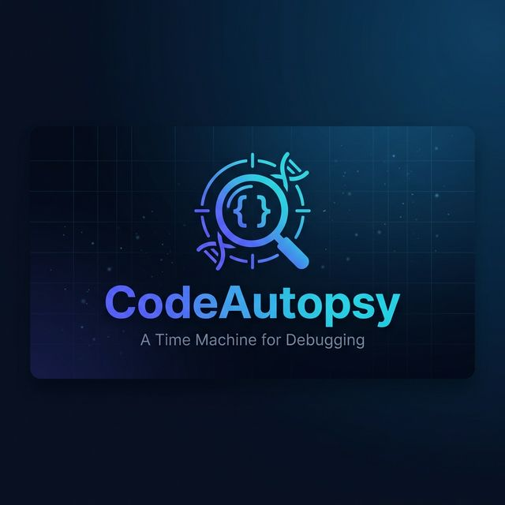

<p align="center">
  
</p>

<h1 align="center">CodeAutopsy</h1>
<p align="center">
  <strong>A Time Machine for Debugging</strong>
</p>
<p align="center">
  Don't just find bugs — discover <em>when</em> they were introduced, <em>who</em> wrote them, and <em>how</em> they evolved.
</p>
<p align="center">
  
  
  
  
  
</p>

---

## What is CodeAutopsy?

CodeAutopsy is a web-based code analysis platform that combines **static security scanning** with **AI-powered insights** and **Git forensics**.

While tools like SonarQube or Snyk tell you *"Line 45 has SQL injection"*, CodeAutopsy shows you:
- 📊 A visual timeline of how that buggy code evolved across commits
- 👤 Who introduced the vulnerability and when
- 🤖 AI-generated fix suggestions with confidence scoring
- 🔬 369 programming languages detected automatically

---

## Features

| Feature | Status |
|---------|--------|
| 🔗 GitHub URL Analysis | ✅ Live |
| 🛡️ Static Security Scanning (16 regex rules + Semgrep) | ✅ Live |
| 📊 Code Health Score (0–100) | ✅ Live |
| 🌐 369 Language Detection (904 extensions) | ✅ Live |
| 📡 Real-time SSE Progress Streaming | ✅ Live |
| 🌙 Dark/Light Theme Toggle | ✅ Live |
| 🔍 Code Archaeology (Git blame, timeline) | 🔜 Upcoming |
| 🤖 AI-Powered Fix Suggestions (Groq) | 🔜 Upcoming |
| 📝 In-Browser Code Editor (Monaco) | 🔜 Upcoming |

---

## Tech Stack

| Layer | Technology |
|-------|-----------|
| **Frontend** | React 19, Vite 8, Tailwind CSS 4, Framer Motion, Zustand, Recharts, Lucide Icons |
| **Backend** | Python 3.10+, FastAPI, SQLAlchemy, GitPython |
| **Analysis** | Semgrep (optional), Regex-based scanner (built-in) |
| **AI** | Groq API (upcoming) |
| **Database** | SQLite |

---

## Quick Start

### Prerequisites

- **Python 3.10+** — [Download](https://www.python.org/downloads/)
- **Node.js 18+** — [Download](https://nodejs.org/)
- **Git** — [Download](https://git-scm.com/)

### 1. Clone the Repository

```bash
git clone https://github.com/Sivanandhpp/CodeAutopsy.git
cd CodeAutopsy
```

### 2. Backend Setup

```bash
cd backend

# Create virtual environment
python -m venv venv

# Activate it
# Windows:
.\venv\Scripts\activate
# macOS/Linux:
source venv/bin/activate

# Install dependencies
pip install -r requirements.txt

# Create .env file (copy the example)
cp .env.example .env
# Or on Windows:
copy .env.example .env
```

Edit `backend/.env` with your keys:

```env
# Required for AI features (Checkpoint 5)
GROQ_API_KEY=gsk_your_key_here

# Optional — increases GitHub API rate limit
GITHUB_TOKEN=ghp_your_token_here

# Database (default SQLite, works out of the box)
DATABASE_URL=sqlite:///./data/codeautopsy.db

# CORS
CORS_ORIGINS=http://localhost:5173,http://localhost:3000
```

Start the backend:

```bash
python -m uvicorn app.main:app --reload --port 8000
```

You should see:
```
🔬 CodeAutopsy API is running!
📊 Database: sqlite:///./data/codeautopsy.db
```

### 3. Frontend Setup

```bash
cd frontend

# Install dependencies
npm install

# Start dev server
npm run dev
```

The frontend will be available at **http://localhost:5173**

### 4. Try It Out

1. Open http://localhost:5173
2. Paste a GitHub URL (e.g. `https://github.com/pallets/flask`)
3. Click **Analyze** and watch the real-time progress
4. Explore the Results Dashboard — health score, issues, file tree

---

## Project Structure

```
CodeAutopsy/
├── backend/
│   ├── app/
│   │   ├── api/
│   │   │   └── routes/
│   │   │       ├── analysis.py      # Analysis endpoints (POST/GET/SSE)
│   │   │       └── health.py        # Health check endpoint
│   │   ├── models/
│   │   │   └── database.py          # SQLAlchemy models & DB setup
│   │   ├── services/
│   │   │   ├── git_service.py       # Repo cloning, file tree, language detection
│   │   │   └── static_analyzer.py   # Semgrep + regex security scanning
│   │   ├── utils/
│   │   │   ├── languages.py         # 904 extension → language mappings
│   │   │   └── progress.py          # SSE progress tracker
│   │   ├── config.py                # App settings (env-based)
│   │   └── main.py                  # FastAPI app entry point
│   ├── requirements.txt
│   └── .env
│
├── frontend/
│   ├── src/
│   │   ├── components/
│   │   │   ├── analysis/
│   │   │   │   └── ResultsDashboard.jsx  # Analysis results UI
│   │   │   ├── landing/                  # Landing page sections
│   │   │   └── ui/                       # Reusable UI components
│   │   ├── lib/
│   │   │   ├── api.js                    # Axios API client
│   │   │   └── analysisStore.js          # Zustand state management
│   │   ├── pages/
│   │   │   ├── LandingPage.jsx           # Home page
│   │   │   └── AnalysisPage.jsx          # Analysis progress + results
│   │   ├── App.jsx
│   │   └── index.css                     # Global styles & design tokens
│   ├── package.json
│   └── vite.config.js
│
├── docs/
│   └── banner.png
└── README.md
```

---

## API Endpoints

| Method | Endpoint | Description |
|--------|----------|-------------|
| `GET` | `/health` | Health check + DB status |
| `POST` | `/api/analyze/github` | Start a new analysis (body: `{ "repo_url": "..." }`) |
| `GET` | `/api/results/{id}` | Get analysis results |
| `GET` | `/api/analyze/stream/{id}` | SSE stream of progress updates |
| `GET` | `/api/files/{id}?path=...` | Read file from analyzed repo |

---

## Environment Variables

| Variable | Required | Description |
|----------|----------|-------------|
| `DATABASE_URL` | ✅ | Database connection string (default: SQLite) |
| `CORS_ORIGINS` | ✅ | Allowed frontend origins (comma-separated) |
| `GROQ_API_KEY` | ❌ | Groq API key for AI features |
| `GITHUB_TOKEN` | ❌ | GitHub PAT for higher rate limits |
| `MAX_REPO_SIZE_MB` | ❌ | Max repo size to clone (default: 100) |
| `MAX_ANALYSIS_PER_HOUR` | ❌ | Rate limit per IP (default: 5) |

---

## Optional: Enhanced Analysis with Semgrep

The built-in regex scanner covers 16 common security patterns. For deeper analysis with 1000+ rules:

```bash
pip install semgrep
```

CodeAutopsy automatically detects and uses Semgrep when available, falling back to the regex scanner otherwise.

---

## Roadmap

- [x] **Checkpoint 1** — Project foundation, landing page, dark/light theme
- [x] **Checkpoint 2** — GitHub integration, static analysis, results dashboard
- [ ] **Checkpoint 3** — Code Archaeology Engine (git blame, timeline visualization)
- [ ] **Checkpoint 4** — In-browser code editor with Monaco
- [ ] **Checkpoint 5** — AI-powered insights with Groq (fix suggestions, confidence scoring)
- [ ] **Checkpoint 6** — Polish, export reports, deployment

---

## Contributing

1. Fork the repository
2. Create your feature branch (`git checkout -b feature/amazing-feature`)
3. Commit your changes (`git commit -m 'Add amazing feature'`)
4. Push to the branch (`git push origin feature/amazing-feature`)
5. Open a Pull Request

---

## License

This project is licensed under the MIT License.

---

<p align="center">
  Built with ❤️ by <a href="https://github.com/Sivanandhpp">Sivanandh P P</a>
</p>
